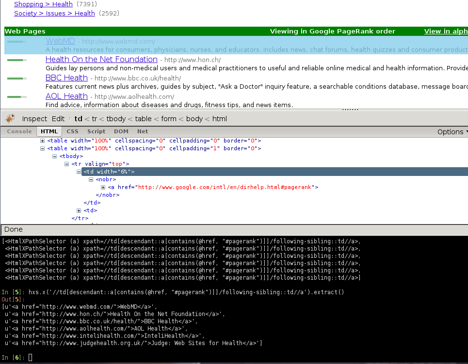

# 使用 Firebug 进行爬取

> 注解
> 
> 本教程所使用的样例站 Google Directory 已经[被 Google 关闭](http://searchenginewatch.com/article/2096661/Google-Directory-Has-Been-Shut-Down)了。不过教程中的概念任然适用。 如果您打算使用一个新的网站来更新本教程，您的贡献是再欢迎不过了。 详细信息请参考 [Contributing to Scrapy](http://scrapy-chs.readthedocs.org/zh_CN/latest/contributing.html#topics-contributing)。

## 介绍

本文档介绍了如何适用 [Firebug](http://getfirebug.com/)(一个 Firefox 的插件)来使得爬取更为简单，有趣。更多有意思的 Firefox 插件请参考[对爬取有帮助的实用 Firefox 插件](http://scrapy-chs.readthedocs.org/zh_CN/latest/topics/firefox.html#topics-firefox-addons)。使用 Firefox 插件检查页面需要有些注意事项:`在浏览器中检查 DOM 的注意事项`。

在本样例中将展现如何使用 [Firebug](http://getfirebug.com/) 从 [Google Directory](http://directory.google.com/) 来爬取数据。Google Directory 包含了`入门教程`里所使用的 [Open Directory Project](http://www.dmoz.org/) 中一样的数据，不过有着不同的结构。

Firebug 提供了非常实用的`检查元素`功能。该功能允许您将鼠标悬浮在不同的页面元素上， 显示相应元素的 HTML 代码。否则，您只能十分痛苦的在 HTML 的 body 中手动搜索标签。

在下列截图中，您将看到 检查元素 的执行效果。


首先我们能看到目录根据种类进行分类的同时，还划分了子类。

不过，看起来子类还有更多的子类，而不仅仅是页面显示的这些，所以我们接着查找:


正如路径的概念那样，子类包含了其他子类的链接，同时也链接到实际的网站中。

## 获取到跟进(follow)的链接

查看路径的 URL，我们可以看到 URL 的通用模式(pattern):

[http://directory.google.com/Category/Subcategory/Another_Subcategory](http://directory.google.com/Category/Subcategory/Another_Subcategory)

了解到这个消息，我们可以构建一个跟进的链接的正则表达式:

```
directory\.google\.com/[A-Z][a-zA-Z_/]+$
```

因此，根据这个表达式，我们创建第一个爬取规则:

```
Rule(LinkExtractor(allow='directory.google.com/[A-Z][a-zA-Z_/]+$', ),
    'parse_category',
    follow=True,
),
```

`Rule` 对象指导基于 `CrawlSpider` 的 spider 如何跟进目录链接。 parse_category 是 spider 的方法，用于从页面中处理也提取数据。

spider 的代码如下:

```
from scrapy.contrib.linkextractors import LinkExtractor
from scrapy.contrib.spiders import CrawlSpider, Rule

class GoogleDirectorySpider(CrawlSpider):
    name = 'directory.google.com'
    allowed_domains = ['directory.google.com']
    start_urls = ['http://directory.google.com/']

    rules = (
        Rule(LinkExtractor(allow='directory\.google\.com/[A-Z][a-zA-Z_/]+$'),
            'parse_category', follow=True,
        ),
    )

    def parse_category(self, response):
        # write the category page data extraction code here
        pass
```

## 提取数据

现在我们来编写提取数据的代码。

在 Firebug 的帮助下，我们将查看一些包含网站链接的网页(以 [http://directory.google.com/Top/Arts/Awards/](http://directory.google.com/Top/Arts/Awards/)为例)，找到使用 Selectors 提取链接的方法。我们也将使用 `Scrapy shell` 来测试得到的 `XPath` 表达式，确保表达式工作符合预期。



正如您所看到的那样，页面的标记并不是十分明显: 元素并不包含 `id`，`class` 或任何可以区分的属性。所以我们将使用等级槽(rank bar)作为指示点来选择提取的数据，创建 XPath。

使用 Firebug，我们可以看到每个链接都在 `td` 标签中。该标签存在于同时(在另一个 `td`)包含链接的等级槽(ranking bar)的 `tr` 中。

所以我们选择等级槽(ranking bar)，接着找到其父节点(tr)，最后是(包含我们要爬取数据的)链接的 td 。

对应的 XPath:

```
//td[descendant::a[contains(@href, "#pagerank")]]/following-sibling::td//a
```

使用 `Scrapy 终端`来测试这些复杂的 XPath 表达式，确保其工作符合预期。

简单来说，该表达式会查找等级槽的 `td` 元素，接着选择所有 `td` 元素，该元素拥有子孙 `a` 元素，且 `a` 元素的属性 `href` 包含字符串 `#pagerank`。

当然，这不是唯一的 XPath，也许也不是选择数据的最简单的那个。 其他的方法也可能是，例如，选择灰色的链接的 `font` 标签。

最终，我们编写 `parse_category()`方法:

```
def parse_category(self, response):

    # The path to website links in directory page
    links = response.xpath('//td[descendant::a[contains(@href, "#pagerank")]]/following-sibling::td/font')

    for link in links:
        item = DirectoryItem()
        item['name'] = link.xpath('a/text()').extract()
        item['url'] = link.xpath('a/@href').extract()
        item['description'] = link.xpath('font[2]/text()').extract()
        yield item
```

注意，您可能会遇到有些在 Firebug 找到，但是在原始 HTML 中找不到的元素， 例如典型的`<tbody>`元素， 或者 Firebug 检查活动 DOM(live DOM)所看到的元素，但元素由 javascript 动态生成，并不在 HTML 源码中。 (原文语句乱了,上面为意译- -: or tags which Therefer in page HTML sources may on Firebug inspects the live DOM )。
